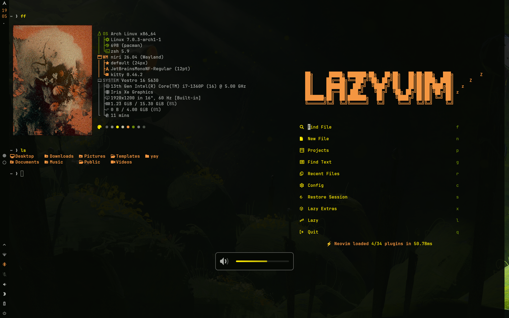
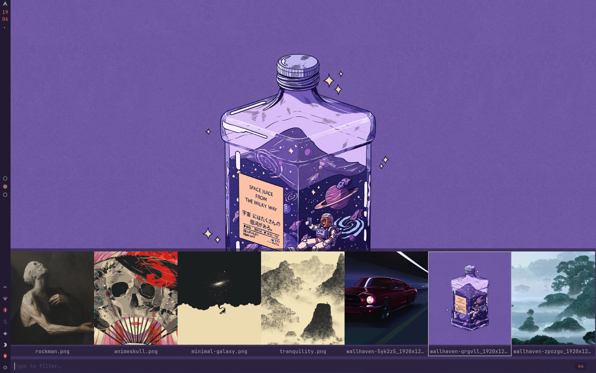
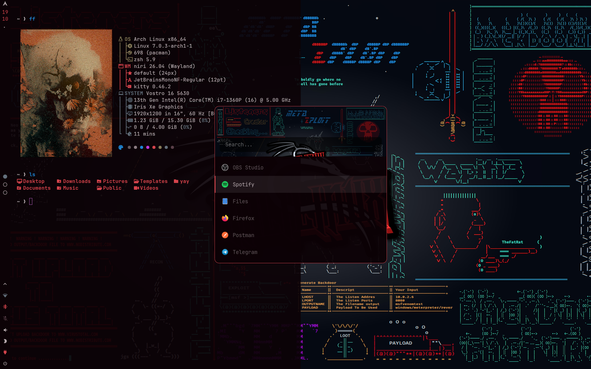
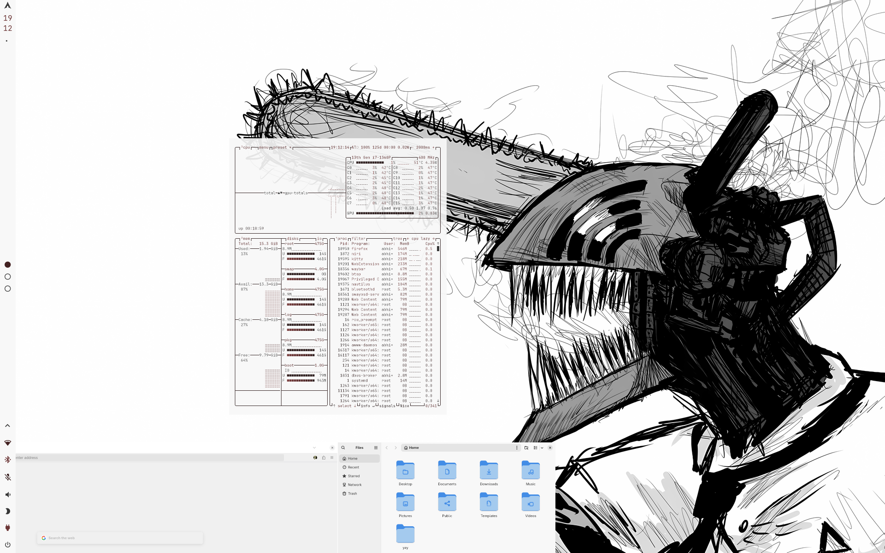
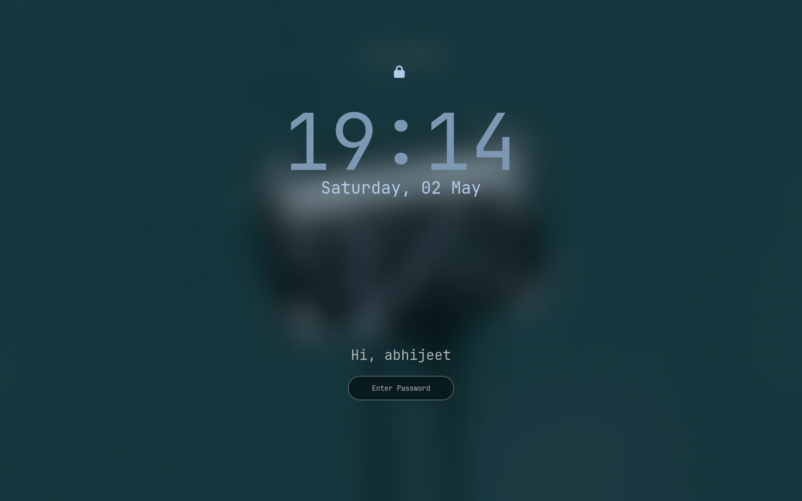
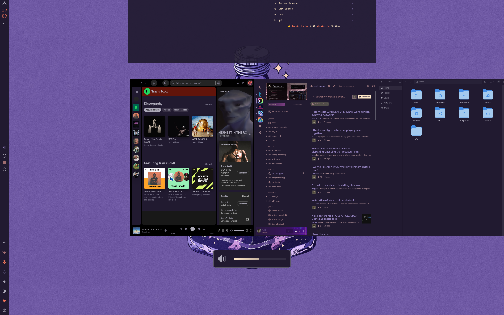

<div align="center">

# niri-dotfiles

</div>

## Previews

<table>
  <tr>
    <td colspan="2"></td>
  </tr>
  <tr>
    <td></td>
    <td></td>
  </tr>
  <tr>
    <td></td>
    <td></td>
  </tr>
  <tr>
    <td colspan="2"></td>
  </tr>
</table>

## Details

| Property | Value |
|---|---|
| **Terminal** | Kitty |
| **Shell** | Zsh + Starship |
| **Editor** | Neovim (LazyVim) |
| **Bar** | Waybar |
| **Launcher** | Rofi |
| **Notifications** | Mako |
| **OSD** | SwayOSD |
| **Browser** | Firefox |
| **File Manager** | Nautilus / Yazi |
| **Music** | Spotify + Spicetify |
| **Discord** | Vesktop |
| **Theme Engine** | [wallust](https://codeberg.org/explosion-mental/wallust) — wired with Waybar, Rofi, Vesktop, Spicetify, and more |

## Packages

```
adw-gtk-theme   awww            bluetui         btop
cava            eza             fastfetch        hypridle
hyprlock        hyprpicker      imagemagick      impala
kitty           mako            neovim           rofi
starship        swayosd         waybar           yazi
```

**Extras:**
- **Spotify** — [Spicetify](https://spicetify.app/)
- **Discord** — [Vesktop](https://github.com/Vencord/Vesktop)

## Keybindings

### General

| Shortcut | Action |
|---|---|
| `Mod + Shift + K` | Show all keybindings |
| `Mod + Escape` | Toggle overview |
| `Mod + Shift + Escape` | Power menu |
| `Mod + F2` | Performance menu |
| `Mod + Shift + Q` | Lock screen |

### Applications

| Shortcut | Action |
|---|---|
| `Mod + Return` | Terminal (Kitty) |
| `Mod + Space` | App launcher (Rofi) |
| `Mod + grave` | Scratchpad terminal |
| `Mod + Shift + N` | Neovim |
| `Mod + Shift + F` | File manager (Nautilus) |
| `Mod + Alt + Shift + F` | File manager (Yazi) |

### Window Management

| Shortcut | Action |
|---|---|
| `Mod + W` | Close window |
| `Mod + T` | Toggle floating |
| `Mod + F` | Fullscreen |
| `Mod + M` | Maximize column |
| `Mod + C` | Center column |
| `Mod + Ctrl + C` | Center all visible columns |
| `Mod + [ / ]` | Decrease / increase column width |
| `Mod + Shift + [ / ]` | Decrease / increase window height |

### Screenshot & Utilities

| Shortcut | Action |
|---|---|
| `Mod + S` | Screenshot (interactive) |
| `Mod + Shift + S` | Screenshot entire screen |
| `Mod + Ctrl + S` | Screenshot focused window |
| `Mod + P` | Color picker (Hyprpicker) |
| `Mod + Ctrl + Space` | Toggle Waybar |
| `Mod + Ctrl + Shift + Space` | Wallpaper selector |

## Theming

This setup uses **[wallust](https://codeberg.org/explosion-mental/wallust)** to automatically generate and apply a color scheme from your wallpaper. It is wired into Waybar, Rofi, Vesktop, Spicetify, and more — changing your wallpaper recolors the entire desktop.

### Light Theme

To use a wallpaper in light mode, prefix the filename with `light-`.

> **Example:** `xyz.png` → `light-xyz.png`

## Wallpapers

Place your `Wallpapers` folder inside `~/Pictures`:

```
~/Pictures/Wallpapers/
```

## Installation

> **Note:** The installation script has not been fully tested yet. Use with caution and review the script before running.

1. Clone the repo:
   ```bash
   git clone https://github.com/abhijeet-swami/niri-dotfiles ~/.dotfiles
   ```

2. Place the `Wallpapers` folder in `~/Pictures`.

3. Install the required packages listed above (via `pacman` / `yay`).

4. Copy/symlink config folders to your `~/.config/` directory.
